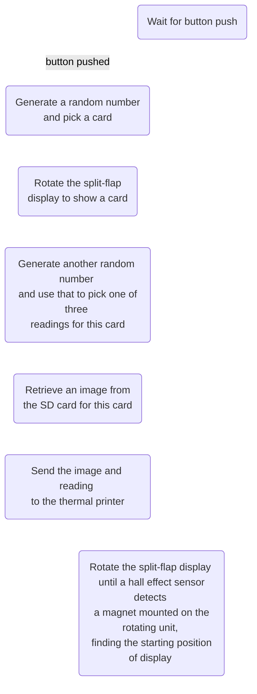





This summer, I built a fun little machine that does Tarot readings! This is the story of how it came to be, warts and all. I learned a ton about how to piece together a project spanning mechanical and electrical systems. Through this little journey of discovery, I hope there are some practical lessons for anybody considering diving into similar projects.

If you’re interested in building your own take on this project, please go for it! Here are some links to resources from this project you might find helpful:

- [github link to the kicad board schematic and layout](https://github.com/zachgoldstein/mechatarot/tree/main/electronics)
- [gerbers, if you just want to get some of the boards made](https://github.com/zachgoldstein/mechatarot/tree/main/gerbers) WARNING: the board is extremely rough and needs a bodge wire on one of the button connector lines
- [link to fusion 360 file for the mechanics](https://a360.co/3BxaTRK)
- [laser cut files](https://github.com/zachgoldstein/mechatarot/tree/main/laserCutFiles)
- [art files](https://github.com/zachgoldstein/mechatarot/tree/main/art)

**If you have any questions, want a version of this for yourself, or just generally want to reach out, please do so! I’m [https://twitter.com/whatthezach](https://twitter.com/whatthezach) on Twitter and reachable at zachgold (at) gmail.com** 

# The Inciting Incident

Burning man 2019 was hugely inspirational for me. I left that experience with a desire to explore both the communities involved and the hardware development process behind many of the projects on display. So, arriving in Toronto, I started reaching out to friends about the southern Ontario regional burner event,  Hyperborea (https://www.tohyperborea.ca/). By the time 2022 came around, I was in touch with a great bunch of folks organizing a camp and started to kick around ideas for fun things to build.

What came up pretty quickly was taking a shot at building my own version of an incredible project I had seen by Ian Mozy (https://www.hackster.io/i_mozy) that he called the ATM or Automated Tarot Machine. He had documented it pretty thoroughly on hackster (https://www.hackster.io/i_mozy/automated-tarot-machine-62d035), and I felt like I had a great shot at executing a version of it in time for the event. Credit also goes to Scott Bezek and his incredible work on open source split-flap displays (https://scottbez1.github.io/splitflap/), which was heavily referenced in both i_mozy’s original work and my attempt here.



# So What Is This?

This little contraption will, upon pressing a button: 

- Pick a tarot card
- Rotate a split-flap display to show that card
- Generate a reading for the card
- Print out both the card and the reading on a little thermal printer

Simple right! Not so fast. Before jumping in, I set a couple of constraints for myself:

- Avoid 3d printed components → Looking at i_mozy’s design, remove the 3d printed base and use laser cuttable materials throughout the structure.
- Simplify wiring → Move beyond the breadboard to a protoboard and then a custom PCB if time permits. The event will be outside, and I won’t be babysitting the machine, so I was concerned about loose wires causing issues.
- Be cuttable on my k40 laser cutter → This laser cannot cut the 5mm thick acrylic in the original i_mozy design. Redesign all the mechanics and joints to use a single, thinner 3mm acrylic.
- Use an Adafruit M4 Express → Migrate code to work on an ATSAMD51-based board, which cuts down on size vs the Arduino Mega. I felt this was a more modern dev board to work off of, and the extra flash memory would give me more room to work with when putting together the code.

# Kicking Things Off

I kicked things off by looking at the core components, testing each of them individually and trying to make sure they could each do what I needed. My experience with stepper motors was limited, and I had not touched thermal printers at all, so I started looking there first.

I managed to start this project by burning out a thermal printer after giving it 12V instead of 9V.

Things continued after that somewhat less chaotically. I got the test examples running for the thermal printer without any trouble and then looked at the stepper motor. Initially, I was excited to put some newer TMC2208 “silent” stepper motor driver modules to use, but I could not manage to get the example sketches working. I think it may have been related to the current limit and not setting that correctly. In any case, I time-boxed it pretty aggressively and shifted quickly to DRV8825 modules, which I had used before. The other major component, the SD card reader, worked well without issue.

The next thing to gauge was the code. I hoped to re-use as much I could from i_mozy’s reference design, but looking at it quickly, I decided to strip it down to the basics and rework the core functions. I shifted around code related to the main modules, removed a few debugging functions I did not need and started to dig into a huge if statement that did a lot of the linking between readings, bitmap data and the card indexes. To consolidate this, I introduced a struct array, which condensed the code nicely and clarified things.

The functional flow for the system:



I focused on cleaning things up and getting to a set of functions I could stub that drove the core components. Then I dived into integration hell. Things went pretty smoothly initially, migrating each test sketch setup into one big breadboard and fleshing out the associated stubs. With everything together, I pressed the big button. My machine greeted me with wild ASCII garbage on the printout from the thermal printer. It was not reading the bitmap data correctly.

# Thermal Printer Bitamp Adventures

Troubleshooting ensued, starting with confirming that I had everything wired correctly. All other thermal printer functions seemed to work well, and the readout from the built-in print debugging looked correct. Turning my attention to the communications between the thermal printer and my dev board, I wondered if the thermal printer I had purchased might be missing bitmap support. I was importing the Adafruit thermal printer library, but I had purchased what looked like an identical printer off of AliExpress, so I expected some surprises. This is the classic Aliexpress electronics experience.



I started looking for documentation about this particular printer with the goal of understanding the commands it accepts and how this library sends them. Unfortunately, there was zero documentation of these details coming from AliExpress, but it did say “MODE:QR701” on the back, so that was my first clue. . After struggling to find the datasheet, I took the printer apart to see if I could see helpful markings on the control board.

TP_701 was similar to the QR701 ID on the product page, so I’m not sure I got that much further here. I went thoroughly down the rabbit hole trying to find this datasheet and eventually google fu-ed my way to an English-translated version of one that felt like it matched what I had. The way that these thermal printers work is you send a set of specific commands on a TTL output line from the microcontroller, which the command board in the printer interprets to drive the heating element and paper spool, printing out alphanumeric characters, barcodes and bitmaps.

Everything except the bitmap printing seemed to work fine, so I started looking at how the Adafruit thermal library printed bitmaps:

```cpp
writeBytes(ASCII_DC2, '*', chunkHeight, rowBytesClipped);
```

So it looks like it uses a `DC2 *` command for bitmaps. While looking through the datasheet, I thought this thermal printer might not support this `DC2 *` command. So, digging into the `printBitmap` function of the Adafruit thermal library, I started attempting to write a new version that would move away from the `DC2 *`  based command to instead use `GS v 0 p wL wH hL hH d1 … dk`. I believed this to be the command this control board wanted.

Futzing with a bit, I ended up with an alternative `printBitmapGS` function that looks like this:

```cpp
void Adafruit_Thermal::printBitmapGS(int w, int h, Stream *fromStream) {
  int rowBytes, rowBytesClipped, rowStart, chunkHeight, chunkHeightLimit, x, y,
      i, c;

  rowBytes = (w + 7) / 8; // Round up to next byte boundary
  rowBytesClipped = (rowBytes >= 48) ? 48 : rowBytes; // 384 pixels max width

  writeBytes(ASCII_GS, 'v', '0', 0, rowBytes % 256, rowBytes / 256, h % 256, h / 256);
  for (y = 0; y < h; y++) {
    for (x = 0; x < rowBytes; x++) {
      while ((c = fromStream->read()) < 0)
        ;
      timeoutWait();
      stream->write((uint8_t)c);
    }
    for (i = rowBytes - rowBytesClipped; i > 0; i--) {
      while ((c = fromStream->read()) < 0)
        ;
    }
  }
  timeoutSet(h * dotPrintTime);
  prevByte = '\n';
}
```

At a high level, this is writing `GS v 0 p wL wH hL hH`, then reading out bitmap bytes from `fromStream`, and writing them as a stream of data `d1 … dk`.



I was thrilled to get this working. I looked at this challenge as a dealbreaker issue for the project and was pleased to work around it. With the critical parts of the system integrated, it was then time to try and shift off the breadboard to something marginally more permanent. My hope was that a protoboard would be viable enough for the event, and any further tweaks to the electronics would be nice non-critical optimizations.

# Moving To Protoboard

I ended up with this abomination:

<div text-align="center" padding="2rem 2rem" margin="0">
    
    
</div>

Lots of lessons here, very messy stuff. I pretty intentionally threw this together very quickly with the goal to just get it working. I had an eye toward building a board for this but wasn’t sure it was worth the effort. Looking back, I learned a couple of lessons in building this protoboard:

- I think it worked out great to try keeping the wiring on the bottom with the components, modules & dev board on top.
- Writing out what components were on the board helped keep track of things, though I would like to have done so more neatly.

- I used pre-formed jumper wires from a kit, which was a terrible idea. I don’t think it would have taken much longer to cut them myself, and it would have cleaned up things a ton. I’ve since gotten an excellent wire stripper from Jonard Tools, which does an excellent job stripping fine wires. I would highly suggest checking it out.




- I wish I had tried to use different colours for signal wires, power, ground, etc. Troubleshooting was made much more difficult with so make wires of the same colour
- I set up two long wires to act as power and ground rails, which helped add clarity.



# Mechanical Design

I switched gears into the mechanics of the design at this point and kicked it off by setting a few high-level design goals:

- **Keep the guts visible**. I wanted people to see some of the details that made this thing work and avoid hiding it inside an enclosure.
- **Only use laser-cut 3mm acrylic**. I knew I could cut this quickly and I felt it would speed up iterations. Also, I wanted to avoid 3d printing b/c it can be time-consuming to run the printer. I think 3d printing is best suited to complicated geometries, and in this project, we were  dealing with a pretty simple structure connected by 90-degree joints.
- **Minimize the use of acrylic welding**. Acrylic welding works really well, but it’s a pretty permanent solution. I thought I may want to only iterate on specific pieces of the overall design and that it would speed things up overall to use nuts & bolts wherever possible.

The next step was to work through the mechanics in Fusion 360 and start blocking out the large structures. Thankfully I could reference both i_mozy’s design and Scott Bezek’s split-flap projects and see how they approached these problems. I particularly liked how i_mozy’s design used nuts and bolts as the main joints connecting the base to the top unit holding the split-flaps, so I integrated that pretty early. Next, I opted to use super tall brass standoffs between the top and bottom parts of the base to make a big sandwich with the thermal printer in the middle.

**The trickiest part of the mechanical design was dialling in how the actual split-flaps felt and moved.** Overall, it took about three or four revisions to get confident that my design would be functional. I began by ensuring the rotating pieces fit together and opted for adjustable slots I could play with. These slots ended up being critical; if a stop was set too closely to the cards, they would cause the stepper motor to skip steps and eventually halt. At the other extreme, if the stop was positioned too far, the cards would not be able to maintain a repeatable position when rotating. In my design, I decided to use the beefy NEMA 17 stepper motors that i_mozy used instead of the lower-cost 28byj-48 steppers used in Scott Bezek’s split-flap design. I chose to use longer, 1mm acrylic for the flaps, and I think this material and length probably impact the torque required to spin the display. Also, the beefier NEMA 17 probably gave me more play in positioning the stops. I think it’s super clever that the split-flap project uses off-the-shelf id cards for the flaps, but remember that this material is scary to laser-cut. It’ll throw out an excellent combination of demonic black fumes and chlorine gas. I think I cut one flap as a test and immediately jumped ship to 1mm acrylic.



# The Cards

Tarot cards are larger and longer than regular playing cards, and the deck has 78 cards instead of 50. Like a standard playing card deck, there are four suits of 14 cards each, wands, pentacles, swords, and cups. These cards are typically called the minor arcana. Tarot cards also add 22 more cards that make up the major arcana, numbered 0-21, with a card named the Fool being typically unnumbered and occupying the 0-index.

The cards used here are from the classic **Rider–Waite** deck, which was initially published in 1909 and is now wonderfully public domain. I had to change the layout of the original graphics files from i_mozy a bit to fit into my printer. With an inkjet printer, I printed 9 cards at a time on sticker paper, cut them out with an Exacto knife and stuck them to my flaps. It took a bit of coaxing to fit the cards into the rotating top unit of the machine, and some care needs to be taken to avoid snapping off the little nubbins on the cards. Overall this was a big time sink but the processing i_mozy did to the graphics saved a lot of time, so massive credit to him here.

With all this worked out, I had a working prototype!




I then looked to get the thing in front of captive audiences for early feedback. It was clear that this thing could break in several different ways, so I wanted to create situations for that to happen early. The first time I showed the project to a friend, it did not work at all. It would turn on, but pressing the button would not trigger the split-flap display to rotate. Digging into it, I noticed a little wire to the stepper motor had bent and broken off. **My faith in the little protoboard abomination was shaken, and I resolved to make a quick board to make all the wiring more reliable.**

# Protoboard To PCB

Printed circuit boards can be a blast to quickly throw together. It often feels like it works a different part of my brain than software; there’s a bit of a geometric puzzle going on when doing the layout, and hanging together a schematic really codifies what’s going on in a breadboard or protoboard. This design is super simple, with a dev board and stepper motor module at the centre of attention and some different connectors going off to their respective parts of the system. My constraints going into the board design were pretty loose:

- I wanted to be able to use my hot plate as much as possible to speed up soldering.
- I wanted to ensure the dev board and stepper motor module were replaceable if these components broke or burnt out. I also felt that swapping the dev board might be an excellent shortcut to hot-swap readings down the line.

I got a few boards made with OSHPark’s prototyping service, and they arrived in Toronto about ten days later.


<div text-align="center" padding="2rem 2rem" margin="0">
    
    
</div>

This rushed design had a ton of teachable mistakes. The most critical was a totally unconnected pin to the press button in the top right corner of the board. I had run DRC (design rules check) successfully early after finishing the initial design but opted to move a few things around and forgot to rerun it. So, predictably, I missed a connection. Aside from that, this is another example of something that works but could do with a lot of polish:

- In using through-hole headers, I ignored my goal of using the hot plate for everything. I think using SMD headers would clean up the layout and give me more flexibility in how to route traces.
- The connector placement could be improved to make them cleaner and more consistent.
- There’s quite a lot of vias for what this is; I’d love to cut that down and see if I can route things more simply.
- I don’t like how the different pins stepper motor pins have different lengths; I’d like to see if I can clean that up, so they’re much closer.
- I added a capacitor on the 9V supply line to smooth out any ripple coming from the cheapo power supply I used. I’m not sure this helped much, and it needs a rethink. I’d like to look at how the voltage changes when the stepper motor and thermal printer pull a ton of current, then decide if I need more smoothing. I think it may be overkill to introduce a regulator here, but I’d like to at least consider it.

At this point, I again looked for opportunities to publicly break the machine before the event. My local coworking space was game, so I brought it in and left it there for folks to play with for a week. Thankfully this surfaced some helpful bugs:

- The printout for one of the last cards in the deck, the queen of pentacles, showed a garbled image. Copying over the data to the SD card again seemed to fix the issue, but I’m uncertain if the root issue was corrupted data or something else
- Occasionally, cards would get skipped when they got “sticky”, and the little nubbins pushed too hard against the rotator unit. I tried to replace these cards with ones that moved more freely.
- The stepper motor would start homing while the thermal printer was printing. This causes a big current draw that I worried might overload the 2A power supply I used. To resolve this, I modified the code slightly to prevent the two from running simultaneously.

# The Event

Hyperborea itself morphed into Hypoborea when site issues forced the original event to cancel, and our camp reorganized into a smaller gathering with some folks from Montreal-based camps. Huge thanks to Sheena and Sasha for persevering; they miraculously found another site and marshalled folks to continue on. If it wasn’t for their efforts, I’m not sure I would have finished this project. The little tarot machine worked great during the event, with the only hiccup being when it ran out of paper towards the end of one day. Seeing folks interact with a fun little toy like this was incredibly rewarding and well worth all the effort. A few reports were that the readings resonated with people in an almost eerie way. I love the system's mysticism and the impact it can have.

A few people asked me how this little tarot machine worked, and I think they may have been a tad disappointed in my sterile description of its internals. A big part of Tarot is putting your energy into the cards and the fun of interpreting the result. In this machine, the closest it gets to this idea of energy is in how the initial seed for the random number generator is picked. When the device is turned on, I use a reading from the analog pin to seed the random number generator with a source of entropy. This value is affected by all sorts of factors like temperature, pressure, ambient humidity etc. We can super loosely interpret this as a quantifiable version of the energy in the cards, but I can totally understand how unsatisfying this is for people. I think a fun extension of this project would be adding  more interactivity when sourcing this entropy; maybe when people press the button, they also trigger a temperature sensor or even a pulse oximeter?

Broadly I think I’d say I take a few big lessons from this project:

- Plan to iterate and plan to make the process of iterating itself easy and fast
- Get it in front of people when it’s just barely working. Make it fail as soon as possible to find flaws
- Test individual components thoroughly before integration. I missed the issue with my thermal printer and bitmaps, a dealbreaker issue that I think I got lucky to solve. In the future, I’d like to try catching these types of problems earlier in the process.
- Have a date. I really benefited from a firm date as a goal, and it helped me avoid bit rabbit holes. The project came together over about two months, picking away at it in my free time.

One of the really high-impact decisions on this project was sticking to laser-cut pieces for the structure and holding things together with nuts and bolts I could quickly assemble & disassemble. I think I’d definitely do this again, and I now generally look at 3d printed elements as more of a last resort when there’s complex geometry I can’t break down. I’m also pleased with the decision to make a custom PCB and quite happy with the messy end result. I think in the future, I’d probably do this earlier, even before doing the protoboard. Making a schematic added a lot of clarity to the project, and I think I would have likely ended up with a cleaner protoboard if I could reference it when building.

# What’s Next For This Project?

I have a ton of ideas. This project feels like a great base to build out tons of different concepts:

- Remix the cards and readings! Explore alternative tarot art and other use cases. I think it could be reworked a bit for a trivia night or maybe a fun toy at a wedding. Another idea is to replace the cards with Brian Eno’s oblique strategies and experiment with them as a fun extension to trigger people’s creativity.
- Clean up the way the system is powered, shift from two separate 9V and 5V supplies to a single 9V supply and a step-down module.
- Make it easier to modify the cards and the readings. I think it would be fun to write a script that could generate the bitmap files used by the 3d printer from more common web formats and a simple text file.
- Make it easier to swap out the unit with the cards. Right now, I have to separate the base from the top unit, which can be very time consuming
- Add an interactive element to drive the random number generator used to pick cards and readings.
- Simplify the connector wiring for the unit; instead of haphazardly stuffing the wires into the housing, try to add zip ties to secure and route things better

**And again, if you have any questions, want a version of this for yourself, or just generally want to reach out, please do so! I’m [https://twitter.com/whatthezach](https://twitter.com/whatthezach) on Twitter and reachable at zachgold (at) gmail.com. I’d love to chat with folks about the project**



Big thanks to Sheena, Sasha, Spike and Denise for review on this article.